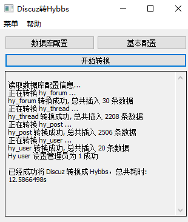

Discuz7.2 转换为 HYBBS
------
一个将Discuz7.2转换成Hybbs的Windows应用程序。

## 使用教程
**安装本项目**
```
go get github.com/skiy/DiscuzToHybbs
```
**编译项目**, 在项目目录下生成 ***exe*** 文件, 打开时会调用 ***CMD*** 窗口
```
go build
```
**编译上线项目**, 在项目目录下生成 ***exe*** 文件, 打开时***不会***调用 ***CMD*** 调试窗口
```
go build -ldflags="-H windowsgui"
```

## TODO
- ✔实现数据库配置信息的读写
- ✔实现数据的转换 - hy_forum_group, hy_forum  
- ✔实现数据的转换 - hy_thread
- ✔实现数据的转换 - hy_post
- ✔实现数据的转换 - hy_user.
- <del>实现数据的转换 - hy_file</del> (由于hybbs与discuz附件架构严重冲突,故暂时解决不了)
- ✔优化数据库 - 使用事务处理方式
- ✔优化 GUI 窗口 - 添加转换日志展示
- 添加 **Discuz!X3.x** 的转换

## 截图


## 注意事项
> 由于此项目本身是本人自用的，程序为 Discuz!7.2, ucenter 与 Discuz 相同数据库；   
> discuz 表前缀为 **cdb_**，ucenter 表前缀为 **cdb_uc_**。

### 鸣谢(本项目使用到的开源库)
- https://github.com/lxn/walk   
- https://github.com/frustra/bbcode


## 联系
作者: Skiychan <dev@skiy.net>   
QQ  : 1005043848   
网站: https://www.skiy.net